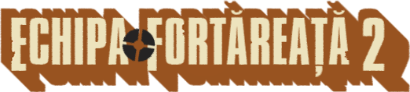

# TF2 Romanian Project

This project is a **FULL** translation of the game Team Fortress 2 in Romanian language, including voice lines (made with [ElevenLabs](https://elevenlabs.io/)), localization and the main game logo.

## Installation

Go to the [releases page](https://github.com/v4n00/tf2-romanian-project/releases), and download the first archive named `tf2-ro-pack` from latest release. Extract the archive in the `Steam/steamapps/common/Team Fortress 2` folder on your computer.

## Progress

### Voice lines - 1%

- [ ] Scout commands
- [x] Soldier commands - 100%
- [ ] Pyro commands
- [ ] Demoman commands
- [ ] Heavy commands
- [ ] Engineer commands
- [ ] Medic commands
- [ ] Sniper commands
- [ ] Spy commands
- [ ] Administrator responses
- [ ] Scout responses
- [ ] Soldier responses - 5%
- [ ] Pyro responses
- [ ] Demoman responses
- [ ] Heavy responses
- [ ] Engineer responses
- [ ] Medic responses
- [ ] Sniper responses
- [ ] Spy responses

### Localization - 20%

- [ ] Weapons
- [ ] Cosmetics

### Logo - 100%

- [x] Design
- [x] VTF conversion
